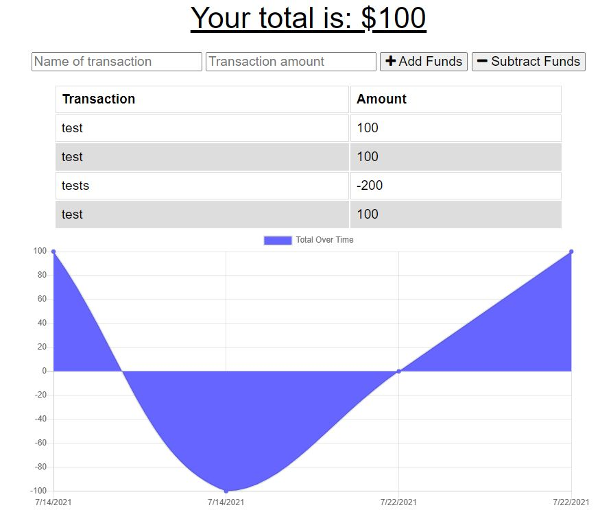

# Budget Tracker 

## Description:
A user interactive website for tacking a budget. The application allows for offline interactions.

## Installation
Perform an npm install

## Usage
Users can create a budget and perform actions offline and allows actions to be submitted when back online.

Websites:
github repo -
https://github.com/dr-50/BudgetTracker

live site -
